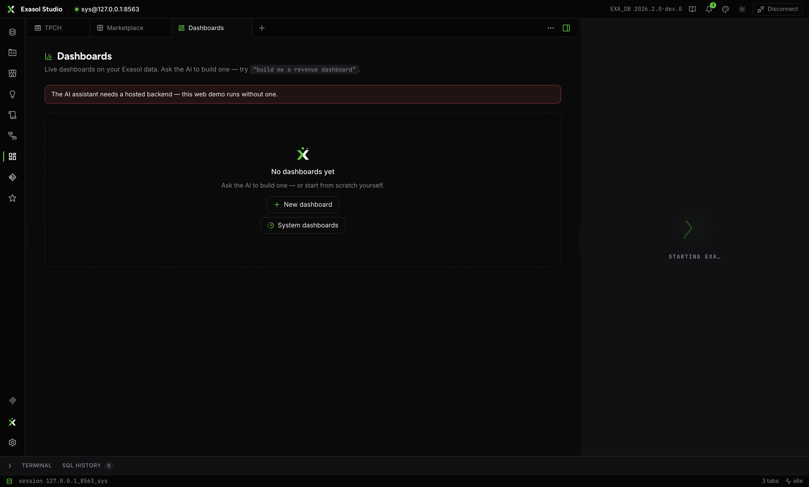

Dashboards are workbench tabs — open several, next to your SQL. The list shows every dashboard as a card, plus the **system dashboards** Studio seeds on demand:

- **Query performance** — statements/24h, failure rate, durations, volume by command class, duration-vs-CPU scatter, heaviest statements.
- **Sessions & activity** — active sessions, sessions by user, session detail.
- **Storage & size** — raw and compressed size, recommended DB RAM, size over the day.

System dashboards are **read-only** — their panels cannot be edited or deleted; your own dashboards are fully yours.

## Panels

Seventeen visualization types: bar, horizontal bar, line, area, pie, donut, radial, treemap, funnel, radar, scatter, heatmap, gauge, KPI, table (server-paged), **explore** (an interactive pivot studio), and **text** (markdown narrative). A quick-switcher regroups them by intent — trend, comparison, composition, distribution, single value, data.

The **panel editor** works inline: pick a dataset from a searchable list of tables/views, or start from one of eight templates (breakdown bar, time series, stacked area, share donut, correlation, KPI total, top-N table, pivot studio); write or adjust the SQL with **Preview**; choose the visualization — suggestions light up based on the data's shape; map the category and value columns; and watch the live preview before saving. An advanced raw-ECharts JSON override exists for the last 5%.

## The grid

Twelve columns; drag panels by their title, resize with the handles, positions persist. Each panel can switch chart type, change its size preset, page its table, or be edited/removed in place.

## Toolbar

**+ Panel**, **History** (every revision, restore any), **Export** (Markdown, HTML report, or PDF), refresh now, and **live auto-refresh** (5/10/30/60&nbsp;s, persisted per dashboard). Dashboards created by the [assistant](./assistant.mdx) appear in the list automatically.
