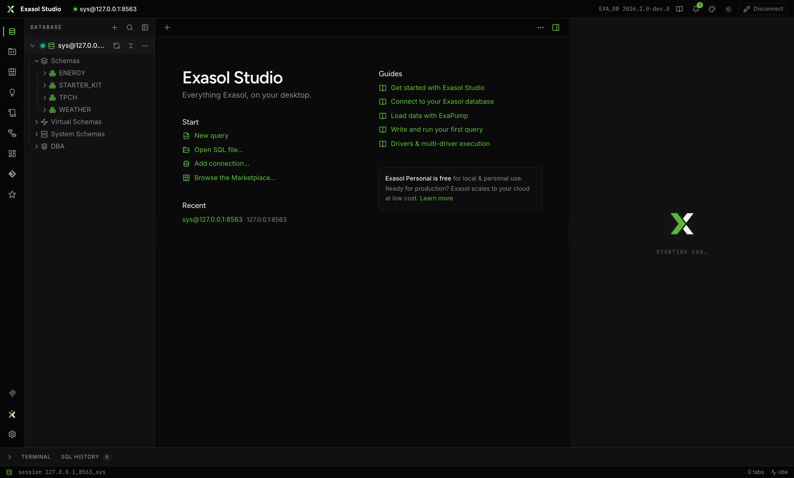

**Exasol Studio** is the graphical home for your Exasol databases: a schema browser, a SQL editor with performance insight, a notebook that is the home for charts and dashboards, a marketplace of add-ons, and an AI assistant — all speaking natively to Exasol.

It is **one product with two doors**, and this documentation covers both:

- **Desktop app** — install it like any app: grab the build for your platform from the [releases page](https://github.com/Sheetaldharshan200/Exasol-studio/releases) (macOS dmg, Windows setup, Linux AppImage/deb/rpm). The full experience, including managing a local **Exasol Personal** database on your machine.
- **Local web app** — if you have the [exa engine](../exa/index.mdx) installed (`npm install -g exa-ai`, or the one-line installer), run `exa web` and the same Studio opens in your browser at `127.0.0.1`, protected by your master password and sharing the same connections. See [Getting started](./getting-started.mdx#the-local-web-app).

| | Desktop app | Local web app (`exa web`) |
| --- | --- | --- |
| SQL workbench, notebook & charts, assistant, marketplace, docs | ✓ | ✓ |
| Shared connections & master-password vault | ✓ | ✓ |
| Install & manage Exasol Personal locally | ✓ | shows what the CLI installed |
| Native terminals, filesystem, separate windows | ✓ | — |

<Callout type="info" title="Studio and exa are one stack">
Connections live in a registry both programs share (`~/.exasol/connections.json`, passwords in the OS credential store). Connect a database in either and it appears in both. The agent inside Studio is the exa engine itself.
</Callout>

## Where to start

- [Getting started](./getting-started.mdx) — install, first run, the local database.
- [Workbench](./workbench/tabs.mdx) — tabs, the [SQL editor](./workbench/sql-editor.mdx), [results](./workbench/results.mdx), [query performance](./workbench/query-performance.mdx), the [schema browser](./workbench/schema-browser.mdx), [object editors](./workbench/object-details.mdx), [DBA tools](./workbench/dba.mdx), the [visualizer](./workbench/visualizer.mdx), [notebooks](./workbench/notebook.mdx), [files & import](./workbench/files.mdx), [history & terminals](./workbench/history-terminal.mdx), and [source control](./workbench/source-control.mdx).
- [Connections](./connections/index.mdx) — connecting, [properties](./connections/properties.mdx), [drivers](./connections/drivers.mdx), [virtual schemas](./connections/virtual-schemas.mdx), and [health, logs & backups](./connections/operations.mdx).
- [Notebook](./workbench/notebook.mdx) — the artifact hub: every chart kind, KPIs, and the system dashboards.
- [AI assistant](./assistant.mdx) — modes, context, slash commands, `!` shell, guardrails.
- [Marketplace](./marketplace.mdx) — every managed component, resolved live from its repo.
- [Settings](./settings.mdx) — the settings window, themes, keyboard shortcuts.
- [Security](./security.mdx) — the master-password vault and where secrets live.
- [AI clients](./ai-clients.mdx) — Claude, Cursor and others on your databases over MCP.
