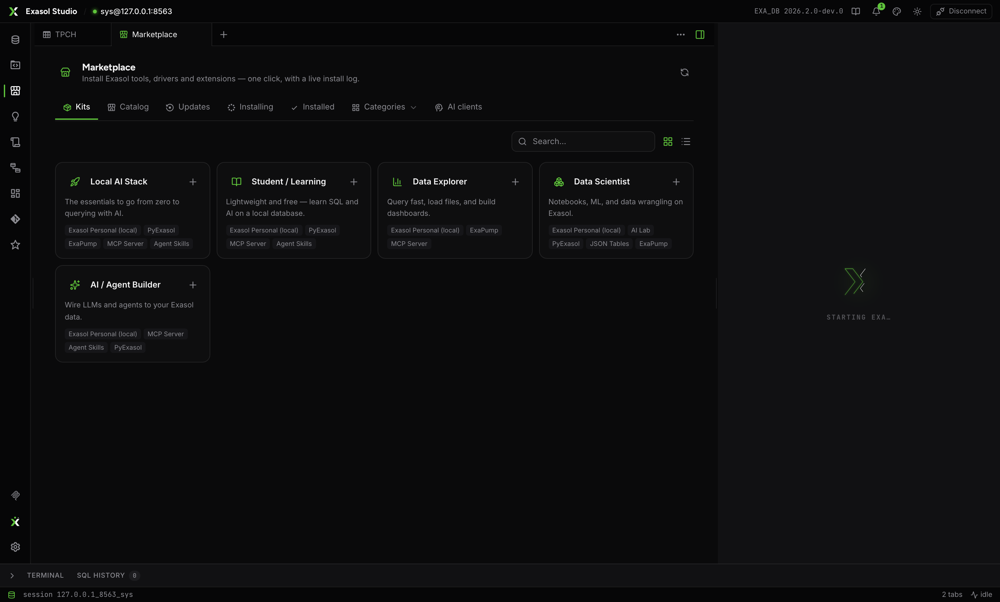

The Marketplace installs and updates everything around Studio. The rule is absolute: every component resolves the **latest release of its own repository** at install time, digest-verified — a component that cannot be verified is refused. Each card carries a **Docs ↗** button to its GitHub page.

## The catalog

| Component | What it is |
| --- | --- |
| Exasol Personal — Local | The local database: install, live running/stopped badge, **Manage (start/stop)**, backup |
| ExaPump | Bulk data movement CLI (drives [Load Data](./workbench/files.mdx)) |
| Semantic Views | Installs **per database** — pick the target, the badge reads *installed in \<db\>* |
| JSON Tables | Document ingest engine (prebuilt, via uv) |
| Exasol MCP Server | The read-only gateway used by [AI clients](./ai-clients.mdx) |
| PyExasol / SQLAlchemy Exasol | Python drivers in a managed environment — *Install & use here* |
| JDBC / ODBC drivers | Managed runtime installs |
| TS/JS, Go, ADO.NET, R, WebSocket API | Reference drivers — *Get* links to their repos |
| Exasol AI Lab | Notebook environment (uv) |
| Exasol Agent Skills | Bundled skills, verified and synced from exasol-labs |

**Kits** bundle these into starter packs — Local AI Stack, Student/Learning, Data Explorer, Data Scientist, AI/Agent Builder — with per-item state and one-click install of what's missing.

## Installing, honestly

The install console shows **the exact steps in plain language before anything runs**, then real progress (byte-level for binaries), collapsible color-coded logs, and an explicit success or failure. Parallel installs queue in a bottom-right toast.

## Updates

The Updates tab compares each installed component against its repository's latest release: **Update to \<tag\>** with a live streamed log, or *All installed components are up to date*. The local database has its own control panel (start, stop, status, info, destroy) and **Back up** action.

## Semantic Views, dynamically honest

After schema-changing DDL run through Studio, active semantic models revalidate in the background — a dropped column that a model still binds surfaces as a notice naming the exact issue. See [SQL editor](./workbench/sql-editor.mdx).
