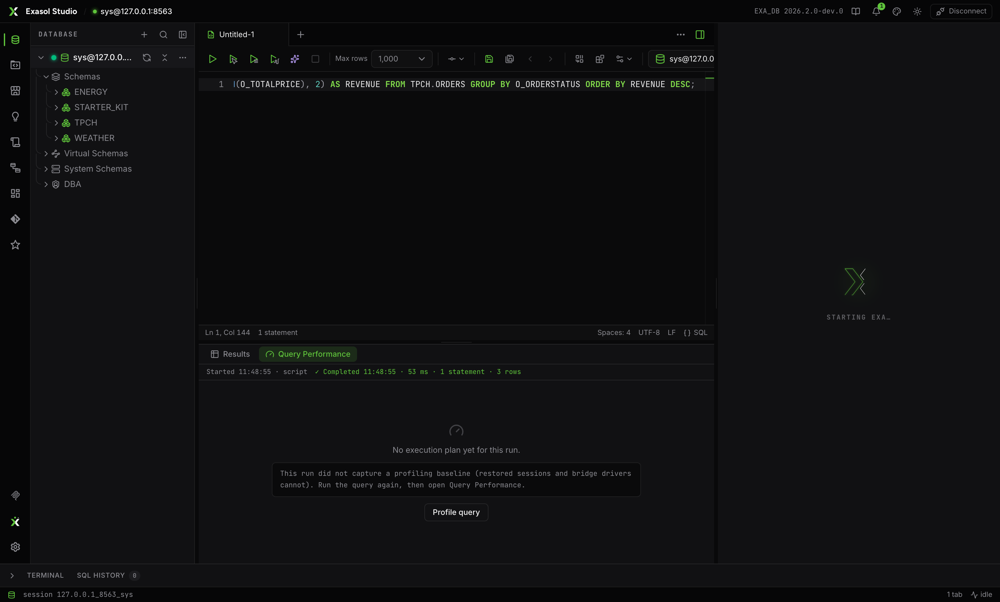

Exasol has no `EXPLAIN`, so Studio shows the honest source instead: opening the **Query Performance** tab auto-profiles the run from `EXA_USER_PROFILE_LAST_DAY` (retrying briefly after `FLUSH STATISTICS`), one plan per statement, named from the statement log.

## The plan graph

An interactive operator graph: each node carries a cost ring, operator type, duration, and object name, with warning markers where something deserves attention; edges are labeled with the rows flowing between operators. Pan, zoom, open the plan in its own tab, or copy it as text.

## Evidence, not vibes

Selecting an operator fills the right rail with the profile columns that back every number: duration and share of total, CPU-max node, rows out, scan selectivity, network MiB, temp DB RAM peak, HDD read/write, per-node row and duration skew, part info and remarks — each citing its source column. Below that: the warnings list (click to jump), a profile overview, a time-by-category bar, and which statistics view the evidence came from.

When there is no plan, the panel says exactly why and offers a manual *Profile query* retry — never an invented diagram.

<Callout type="info" title="In the browser (exa web)">
The bridge driver serving `exa web` cannot capture a per-run profiling baseline, so Query Performance offers a manual **Profile query** instead of the automatic plan — the full experience lives in the desktop app.

</Callout>
