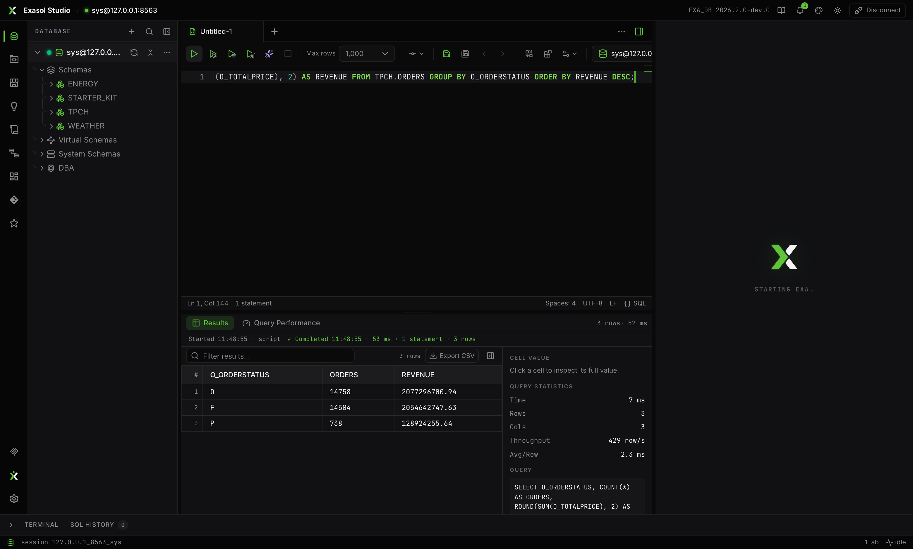

Every run lands in the results panel with a status strip: when it started, a live *Running… Ns* timer, then ✓ Completed or ✗ Failed with duration, statement count, and rows. While a batch runs you see the engine's real progress — statement i of N, its current activity, percent or elapsed — with the previous result pinned underneath.

## Reading results

- **Server-side paging** for a single SELECT: rows a–b with ◀ ▶; pages are prefetched and cached.
- **Filter results…** searches client-side with an *N of M* count; **Export CSV** saves exactly the filtered rows you see.
- **Cell inspector** (side panel): click any cell for its full value, plus Query Statistics (time, rows, columns, throughput, avg/row) and the exact SQL with its run timestamp.
- **Multi-statement runs** get one tab per statement — verb, row count, error marker — with a *go to #* jump box or a merged stacked view. A failing statement never hides the ones that succeeded.
- Large results render incrementally: the first 1000 rows, then *Show more / Show all*. Row numbers, column types in headers, italic `null`, zebra striping and font size follow your Settings.

## Editing data inline

When a result maps to a single table, double-click a cell (or hit **Edit data**) — it works even without a primary key, matching rows on all their column values. Add rows, mark rows for deletion, and then the two-step exit:

1. **Review SQL** — the generated DML opens as text you can read.
2. **Confirm & Save** — only then does anything execute. Errors keep your edits so nothing is lost.

Row-count-only statements report *N rows affected · X ms*; failures show the full error message.
