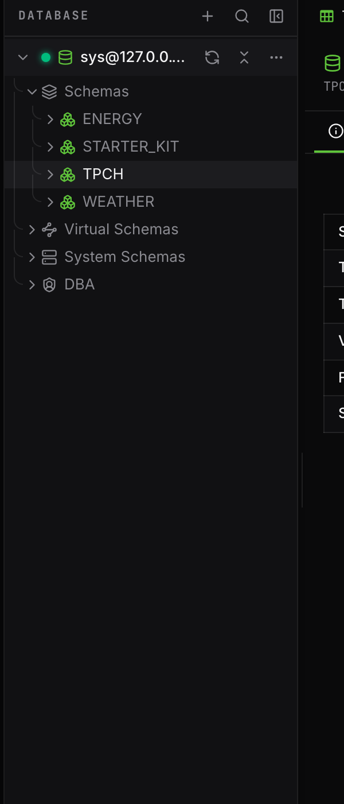

The Databases sidebar shows every connection with a liveness dot (probed continuously), its accent stripe, refresh/collapse controls, and an overflow menu that reaches everything about the connection: info, properties, database info, data types, the DBA dashboard, health, logs, backups, BucketFS, new virtual schema, and disconnect.

## The tree

Schemas → tables / views / functions / scripts (adapters, Lua, UDFs, preprocessors); tables expand into columns (primary-key marker, type, NOT NULL badge) and constraints (PK/FK/NN with the referenced table). Virtual schemas get their own badged folder; system schemas (`SYS`, `EXA_STATISTICS`) their own section; and a **DBA** branch lists users (with consumer group), roles, consumer groups, connections, and live sessions.

Double-click a table or view to open `SELECT * … LIMIT` in a new tab.

## Right-click does the work

Every object type has a purpose-built context menu — a few examples:

| Object | Actions |
| --- | --- |
| Table | Open data · Generate SELECT/INSERT/UPDATE/DELETE · Edit properties/structure/keys… · Truncate/Drop (generate SQL) |
| Schema | Set as default (OPEN SCHEMA) · New table… · Rename/Comment · Drop (confirm, CASCADE) |
| User | Edit roles & privileges… · Change password · Set consumer group · Drop (confirm) |
| Session | Kill session… (confirm) · Copy session id |
| Column | Rename / Change type / Comment · Drop column (confirm) |

The rule everywhere: **creates and edits generate SQL you review; destructive actions confirm first** and say what is irreversible.

## Finding things

The sidebar magnifier fuzzy-searches all database objects (`F3` / `Shift+F3` between matches). Star any schema, table, view, or user into **Favorites** for one-click access. An always-present **Exasol Personal (local)** card shows install/connect/status for the managed local database, and saved-but-disconnected profiles show reachability dots.
